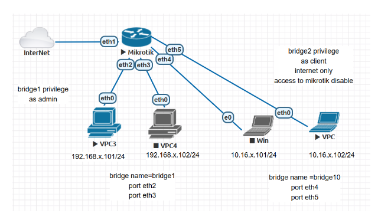
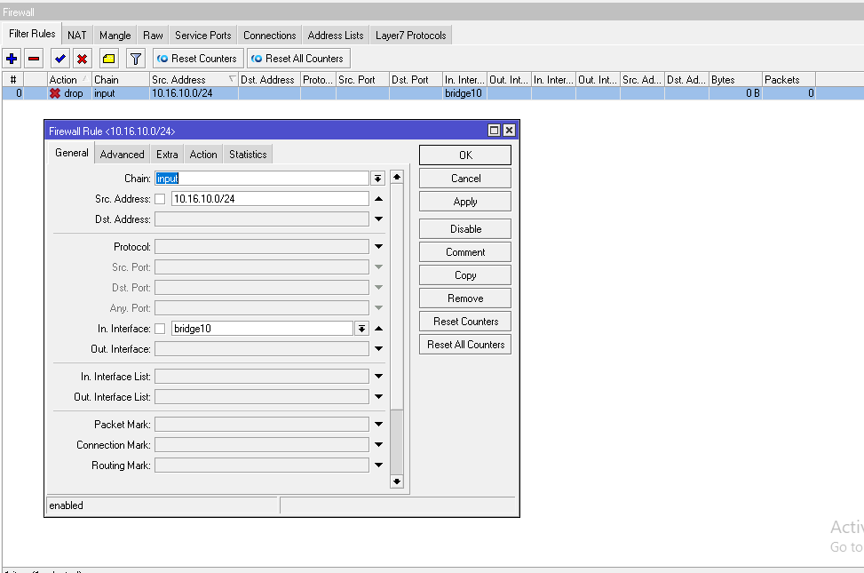
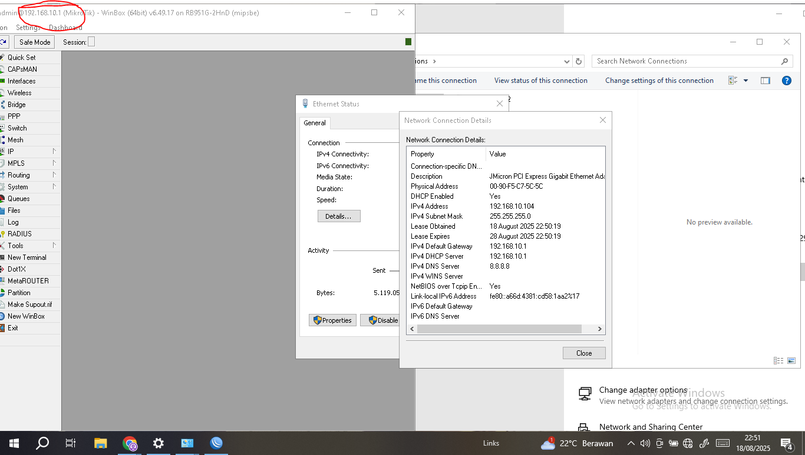

# LAB-19-Bridging-firewall
tanggal 16 Agustus 



# Langkah Konfigurasi Bridging Firewall di Mikrotik via terminal 

1. Buat DHCP Client ke interface yang terhubung ke internet untuk akses internet
   IP > DHCP CLIENT.

     ip dhcp-client add interface=ether1  

2. Buat Bridge untuk Admin

```bash
/interface bridge add name=bridge1
/interface bridge port add bridge=bridge1 interface=eth2
/interface bridge port add bridge=bridge1 interface=eth3
```

3. Buat Bridge untuk Client

```bash
/interface bridge add name=bridge10
/interface bridge port add bridge=bridge10 interface=eth4
/interface bridge port add bridge=bridge10 interface=eth5
```

4. Konfigurasi IP Address 

```bash
/ip address add address=192.168.10.1/24 interface=bridge1
/ip address add address=10.16.10.1/24 interface=bridge10
```
5. Buat DHCP server untuk setiap bridge interface, IP > DHCP SERVER > DHCP SETUP.

    ip dhcp-server setup (bridge1)
   ip dhcp-server setup (bridge10)

6. Aktifkan Firewall NAT agar jaringan lokal bisa mengakses internet, IP > FIREWALL > NAT> ADD.

       ip firewall nat add chain=srcnat action=masquerade out-interface=ether1
  
7. Tambahkan Firewall Filter untuk Membatasi Hak Akses Client,
   IP > FIREWALL > FILTER RULES > ADD.



8. Cek Hasil
   interface clinet


   interface admin



# Kesimpulan

Bridging firewall di Mikrotik mengatur dua fungsi sekaligus yang dimana menggabungkan
interface ke dalam satu segment jaringan, dan membatasi 
hak akses masing-masing segment menggunakan firewall.
